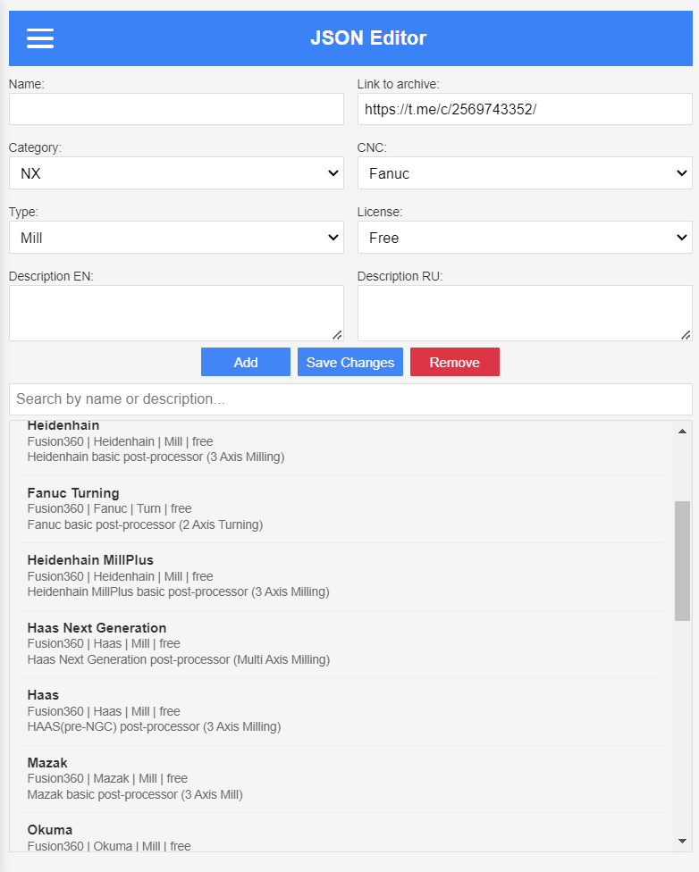
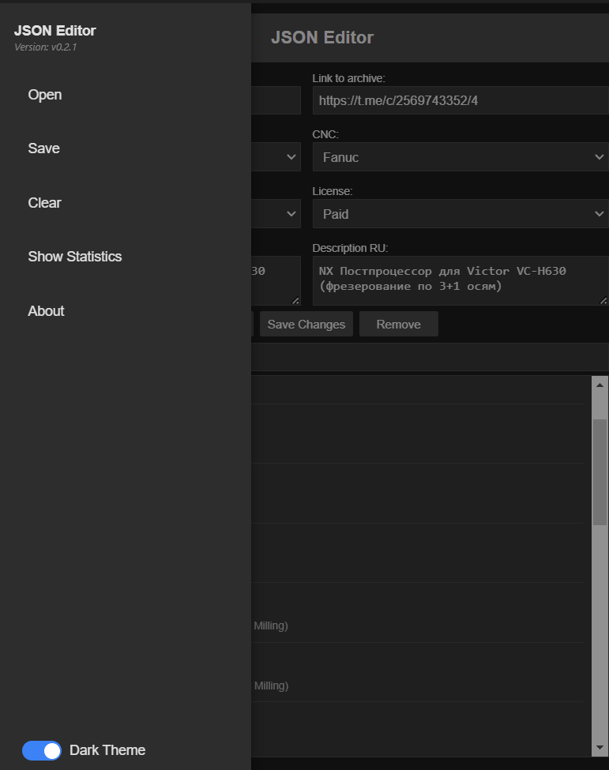

# JSON Editor for Post Processors

A **Progressive Web App (PWA)** for managing CNC post-processor JSON files, designed for seamless integration with Telegram bots like [@postprocessors_bot](https://t.me/postprocessors_bot).

<!-- markdownlint-disable MD033 -->
<details>
  <summary>Click to see the image</summary>
  <h1 align="center">
    
    
  </h1>
</details>

## Table of Contents

- [Features](#features)
- [Usage](#usage)
- [Data Format](#data-format)
- [License](#-license)
- [Contact](#-contact)

## Features

- 📝 Edit post processor parameters
- 💾 Save/load JSON files
- 🔍 Search by name and description
- 📱 Responsive interface
- 📴 Offline mode

## Usage

1. Open an existing JSON file (click "Open")
2. Edit the parameters:
   - Link to archive
   - Category (NX/Fusion360)
   - CNC type (Fanuc, Siemens, etc.)
   - Operation type (milling, turning, etc)
3. Save the changes (click "Save Changes")
4. Export the file (click "Save")

## Data Format

Example entry:

```json
{
  "id": "1",
  "category": "NX",
  "cnc": "Fanuc",
  "name": "VCENTER_H630",
  "type": "milling",
  "license": "paid",
  "desc_en": "Description in English",
  "desc_ru": "Описание на русском",
  "zip_url": "https://t.me/c/CHANNEL_ID/1"
}
```

## 📄 License

This project is licensed under the **MIT License**.
See the [LICENSE.md](LICENSE.md) file for details.

---

## 📞 Contact

**Email:** [maestrofusion360@gmail.com](mailto:maestrofusion360@gmail.com)
**Telegram:** [@MaestroFusion360](https://t.me/MaestroFusion360)

---

<p align="center">
  
</p>
